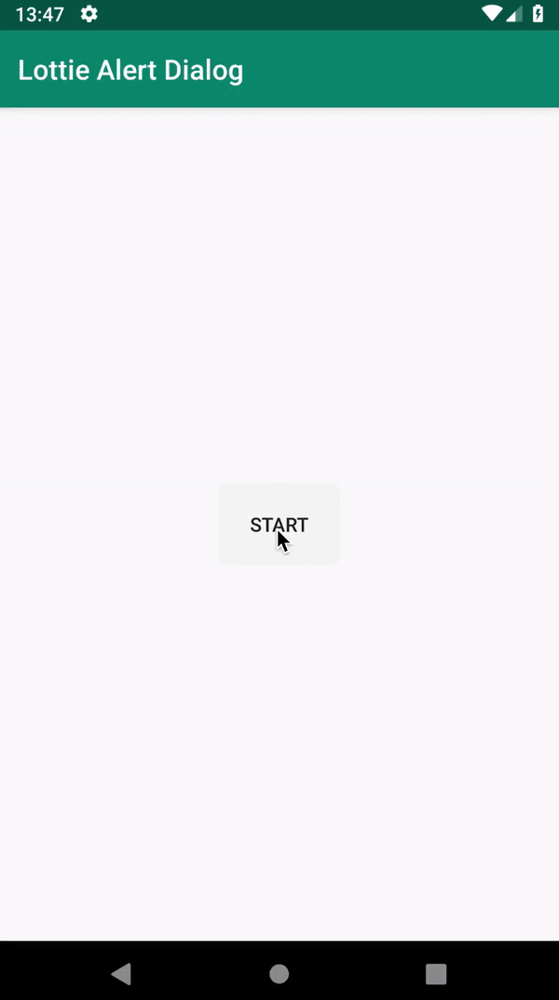

# Lottie Alert Dialog

image:https://img.shields.io/badge/Android%20Arsenal-Lottie%20Alert%20Dialog-brightgreen.svg?style=flat["Android Arsenal", link="https://android-arsenal.com/details/1/7557"]

image::https://img.shields.io/badge/version-1.2-green.svg[]

image::https://img.shields.io/badge/minSDK-16-blue.svg[]

image::https://img.shields.io/badge/license-MIT-yellowgreen.svg[]

This library helps you to create bunch of alert dialogs with Lottie.

## Requirements

*You must add lottie assets to your main folder first, there is a five types of alert dialog and five lottie files in there.
Don't change the names of files just override it. For example you can use assets in this repository.*

https://lottiefiles.com[Download New Lottie Assets]

https://github.com/mayuce/LottieAlertDialog/tree/master/app/src/main/assets[Go To Assets]

You must put your assets to under *app -> src -> main -> assets* folder

Add line below to your *top* level build.gradle

[source,bourne]
----
allprojects {
    repositories {
        /// ....
        maven { url "https://jitpack.io" }
    }
}
----

Add lines below to your *app* level build.gradle

[source,bourne]
----
    implementation 'com.airbnb.android:lottie:2.7.0'
    implementation 'com.github.mayuce:LottieAlertDialog:1.1'
----

And Sync the gradle

## Usage

You may follow the source code to see how it works.

Loading View:

[source,java]
----
var alertDialog : LottieAlertDialog
        alertDialog= LottieAlertDialog.Builder(this,DialogTypes.TYPE_LOADING)
            .setTitle("Loading")
            .setDescription("Please Wait")
            .build()
        alertDialog.setCancelable(false)
        alertDialog.show()
----

Question View:

[source,java]
----
var alertDialog : LottieAlertDialog
alertDialog=LottieAlertDialog.Builder(parentActivity,DialogTypes.TYPE_QUESTION)
                .setTitle("What Type")
                .setDescription("Would you like to see ?")
                .setPositiveText("Error")
                .setNegativeText("Warning")
                .setNoneText("None")
                .setPositiveButtonColor(Color.parseColor("#f44242"))
                .setPositiveTextColor(Color.parseColor("#ffeaea"))
                .setNegativeButtonColor(Color.parseColor("#ffbb00"))
                .setNegativeTextColor(Color.parseColor("#0a0906"))
                .setNoneButtonColor(Color.parseColor("#1cd3ef"))
                .setNoneTextColor(Color.parseColor("#c407c4"))
                // Error View
                .setPositiveListener(object: ClickListener{
                    override fun onClick(dialog: LottieAlertDialog) {
                    // This is the usage same instance of view
                        alertDialog.changeDialog(LottieAlertDialog.Builder(parentActivity,DialogTypes.TYPE_ERROR)
                            .setTitle("Error")
                            .setDescription("Some error has happened.")
                            .setPositiveText("Okay")
                            .setPositiveListener(object : ClickListener{
                                override fun onClick(dialog: LottieAlertDialog) {
                                    dialog.dismiss()
                                }
                            })
                        )
                    }
                })
                // Warning View
                .setNegativeListener(object : ClickListener
                {
                    override fun onClick(dialog: LottieAlertDialog) {
                    // This is the usage same instance of view
                        alertDialog.changeDialog(LottieAlertDialog.Builder(parentActivity,DialogTypes.TYPE_WARNING)
                            .setTitle("Warning")
                            .setDescription("Some warning.")
                            .setPositiveText("Okay")
                            .setPositiveListener(object : ClickListener{
                                override fun onClick(dialog: LottieAlertDialog) {
                                    dialog.dismiss()
                                }
                            }))
                    }
                })
                // Dismiss View
                .setNoneListener(object: ClickListener
                {
                    override fun onClick(dialog: LottieAlertDialog) {
                        dialog.dismiss()
                    }
                })
            )
            .build()
            alertDialog.show()
----

### Additional Features

You can use same instance without interrupting view. If you don't set a variable to button texts, they'll be GONE.

## Thanks

* Thanks *airbnb* for Lottie.

[source,bourne]
----
MIT License

Copyright (c) 2019 Muhammet Ali YUCE

Permission is hereby granted, free of charge, to any person obtaining a copy
of this software and associated documentation files (the "Software"), to deal
in the Software without restriction, including without limitation the rights
to use, copy, modify, merge, publish, distribute, sublicense, and/or sell
copies of the Software, and to permit persons to whom the Software is
furnished to do so, subject to the following conditions:

The above copyright notice and this permission notice shall be included in all
copies or substantial portions of the Software.

THE SOFTWARE IS PROVIDED "AS IS", WITHOUT WARRANTY OF ANY KIND, EXPRESS OR
IMPLIED, INCLUDING BUT NOT LIMITED TO THE WARRANTIES OF MERCHANTABILITY,
FITNESS FOR A PARTICULAR PURPOSE AND NONINFRINGEMENT. IN NO EVENT SHALL THE
AUTHORS OR COPYRIGHT HOLDERS BE LIABLE FOR ANY CLAIM, DAMAGES OR OTHER
LIABILITY, WHETHER IN AN ACTION OF CONTRACT, TORT OR OTHERWISE, ARISING FROM,
OUT OF OR IN CONNECTION WITH THE SOFTWARE OR THE USE OR OTHER DEALINGS IN THE
SOFTWARE.
----
